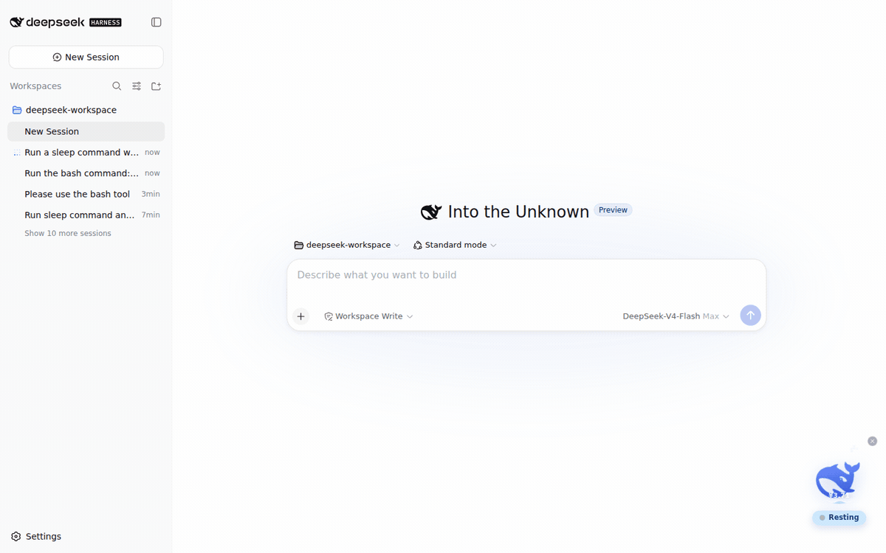

# dsh-desktop-pet

A desktop pet for [DeepSeek Harness](https://github.com/deepseek-ai/deepseek-harness): the official whale mark lives in the shell overlay, floats in a circular sea whose level mirrors your DeepSeek API balance, and reacts to your agent's every move.



## Features

- **Live agent status** — the whale rests, thinks, works, or cries (`❗`) exactly as your agent does, with a status pill that shows the phase, the current tool, and elapsed time.
- **Balance as sea level** — the circular sea around the whale fills to `balance / balanceScale` (¥100 = full by default), the surface is a scrolling wave with a slow tide, and the amount is printed on the water. Low balance also makes the whale droop and complain.
- **Interactive** — click to pet it: a springy jump most of the time, or a rare (40%) charged dive with a 360° spin that lands with a big splash, a high rebound, a little hop, and a final tiny splash. Random chatter lines (zh/en) per state, floating hearts, rising bubbles while thinking, drag it anywhere, minimize to a dot.
- **Zero runtime dependencies** — the bundle ships prebuilt; all `@deepseek-ai/*` services come from the harness itself, so installing needs no build step and no build authorization.

## Install

Prerequisite: a DeepSeek Harness install (web profile recommended).

```bash
# GitHub direct install (prebuilt artifacts, no build authorization needed)
dsh plugin --profile web add github:FenyxHuang/dsh-desktop-pet

# or from a local checkout
dsh plugin --profile web add link:/path/to/dsh-desktop-pet

# or as a tarball
pnpm pack
dsh plugin --profile web add ./dsh-desktop-pet-0.1.0.tgz
```

Restart `dsh` after installing (bundle layers compose at startup). The whale appears in the bottom-left corner of the web UI (left-anchored so that right-side floating panels — e.g. the dsh-better-sidebar Explorer, which sits at `z-index: 50` above the `shell.overlay` layer's `z-index: 20` — never cover it or eat its clicks). It is fully draggable.

### Configuration

The bundle applies the `cordis.patch.yml` layer, which mounts one host row (the browser half is auto-discovered from the package's `dsh.client` declaration — a second entry for the same package would run the host half twice and collide on the `petStatus` service):

| id | package | config |
|---|---|---|
| `pet-status` | `dsh-desktop-pet` | `balanceScale: 100` (the CNY amount at which the sea reads full; the sea level is `balance / balanceScale`, capped at 1) |

The host row reads your DeepSeek API key through the harness's normal credentials (`DEEPSEEK_API_KEY`) and refetches `https://api.deepseek.com/user/balance` at most every 15 seconds. Override any key in your own profile's `cordis.patch.yml`:

```yaml
- update:
    - id: pet-status
      config:
        balanceScale: 500
        balanceRefetchMs: 60000
```

## How it works

One npm package carries both halves, mirroring the official split packages:

- **Host half** (`lib/index.js`) — a Cordis service (`PetStatusService`) that folds `agent/status`, `tools/pre-execute`, `tools/result`, and `agent/error` events into a per-session snapshot and serves it over a generated Typert Remote (`petStatus.snapshot`). The `lib/typert.*` artifacts are generated by `@deepseek-ai/dsh-typert-generator` and committed, so consumers install prebuilt code.
- **Browser half** (`lib/client.js`) — a module-loader bundle that mounts its own Remote contribution, polls it once per second for the current session, and registers the shell-overlay widget. React, Cordis, and the platform modules stay external (the app provides them); everything else is inlined.

The package declares **no runtime dependencies**: the loader resolves `@deepseek-ai/*` names from the dsh install itself, which is the official plugin contract.

## Development

The repo is a self-contained single package (TypeScript + tsdown). Building and testing require an enclosing DeepSeek Harness checkout (the tests alias `@deepseek-ai/*` to its source tree):

```bash
# from inside a harness checkout (e.g. <harness>/.dsh-build/dsh-desktop-pet)
pnpm install
pnpm run build          # tsc both faces + tsdown host bundle + browser bundle
pnpm run test           # 34 pass; the 7 jsdom widget tests need a supported Node (^22.19 || >=24)
```

Regenerate the Typert artifacts only when the Remote surface changes, by copying the output of the harness's own build for the equivalent package and re-patching the package name, or by running the official generator in a `<workspace>/packages/*` layout (its discovery requires that shape).

## License

MIT — derived from the DeepSeek Harness codebase (MIT, © 2026 DeepSeek). The whale mark is DeepSeek's official brand artwork and is used for the widget's own display.
